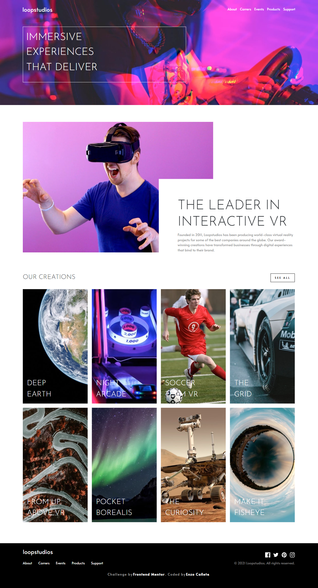

# Frontend Mentor - Loopstudios landing page solution

This is a solution to the [Loopstudios landing page challenge on Frontend Mentor](https://www.frontendmentor.io/challenges/loopstudios-landing-page-N88J5Onjw). Frontend Mentor challenges help you improve your coding skills by building realistic projects. 

## Table of contents

- [Overview](#overview)
  - [The challenge](#the-challenge)
  - [Screenshot](#screenshot)
  - [Links](#links)
- [My process](#my-process)
  - [Built with](#built-with)
  - [What I learned](#what-i-learned)
  - [continued development](#continued-development)
- [Author](#author)

## Overview

### The challenge

Users should be able to:

- View the optimal layout for the site depending on their device's screen size
- See hover states for all interactive elements on the page

### Screenshot

### Links

- Solution URL: [solution URL](https://github.com/EnzoDev10/loopstudios-page)
- Live Site URL: [live site URL](https://enzodev10.github.io/loopstudios-page/)

## My process

### Built with

- Semantic HTML5 markup
- Less custom properties
- Flexbox
- CSS Grid
- Mobile-first workflow
- [Less](https://lesscss.org/) - CSS preprocessor
- [Bootstrap](https://getbootstrap.com/) - CSS Framework

### What I learned

This project didn't teach me a lot of stuff as i used it to put more practice on some things that i used in the past weeks, like bootstrap and making landing pages. Beside that and in an unexpected way, i learned about the picture tag which was really helpful to swap between images depending on the size of the device.

### Continued development
Would love to use bootstrap again or maybe try another CSS framework like tailwind. 

## Author

- Frontend Mentor - [@EnzoDev10](https://www.frontendmentor.io/profile/EnzoDev10)
